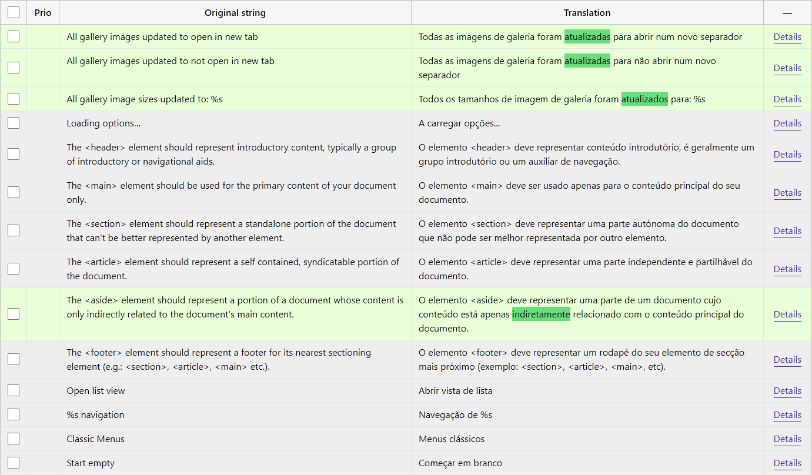
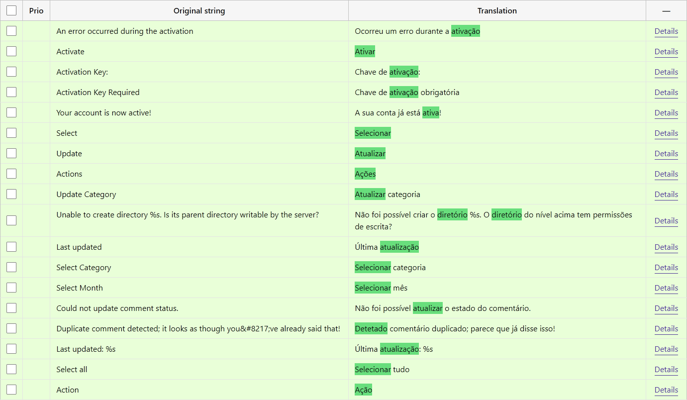
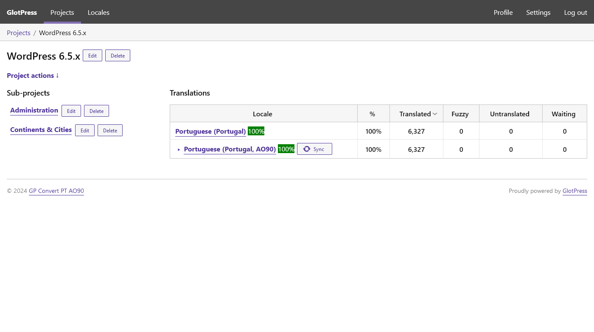

# Convert PT AO90 for GlotPress

Language tool for GlotPress to convert text according to the Portuguese Language Orthographic Agreement of 1990 (PT AO90).

[](https://wordpress.org/plugins/gp-convert-pt-ao90/)
[](https://wordpress.org/support/plugin/gp-convert-pt-ao90/reviews/)
[](https://wordpress.org/plugins/gp-convert-pt-ao90/advanced/)
[](https://github.com/sponsors/pedro-mendonca)

[](https://wordpress.org/plugins/gp-convert-pt-ao90/)
[](https://wordpress.org/plugins/gp-convert-pt-ao90/)
[](https://wordpress.org/plugins/gp-convert-pt-ao90/)

[](https://github.com/pedro-mendonca/GP-Convert-PT-AO90/actions/workflows/coding-standards.yml)
[](https://github.com/pedro-mendonca/GP-Convert-PT-AO90/actions/workflows/static-analysis.yml)
[](https://github.com/pedro-mendonca/GP-Convert-PT-AO90/actions/workflows/plugin-check.yml)
[](https://www.codacy.com/gh/pedro-mendonca/GP-Convert-PT-AO90/dashboard?utm_source=github.com&amp;utm_medium=referral&amp;utm_content=pedro-mendonca/GP-Convert-PT-AO90&amp;utm_campaign=Badge_Grade)

## Description

This plugin for GlotPress customizes the default behavior of the Portuguese (Portugal) Locales, allowing you to automatically convert the approved/current strings in Portuguese (Portugal) to its variant of Portuguese (Portugal, AO90).

It keeps the Portuguese (Portugal) root translations automatically converted and synced with its Portuguese (Portugal, AO90) variant translations within your GlotPress install.

Optionally it's possible to disable the Portuguese (Portugal, AO90) variant translations editing, approval and importing, making it read-only.

The only translations added to the Portuguese (Portugal, AO90) variant translation set are those which are different from the Portuguese (Portugal) root translation.

The strings that don't need any conversion remain untranslated on the variant, falling back to the root Locale.

This plugin was heavily inspired by the [Serbian Latin](https://meta.trac.wordpress.org/ticket/5471) solution for transliteration of Serbian Cyrillic locale from [translate.wordpress.org](https://meta.trac.wordpress.org/browser/sites/trunk/wordpress.org/public_html/wp-content/plugins/wporg-gp-customizations/inc/locales/class-serbian-latin.php?rev=10360).

The language conversion uses the open source tool [Convert PT AO90](https://github.com/pedro-mendonca/Convert-PT-AO90) to replace entire words from a prebuilt list.

## Features

* Check for active GlotPress.
* Check for existent `pt` root and `pt-ao90` variant translation sets.
* Convert `current` Portuguese (Portugal) root translations and add to the Portuguese (Portugal, AO90) variant translations.
* Delete variant unused translations instead of keeping as `rejected`, `fuzzy`, `old`.
* Delete `current` variant translation if a new root translation (same `original_id`) is added and doesn't need conversion.
* Sync button for GlotPress administrators to force convert the complete translation from root set to variant set.
* Highlight the differences in the automatically converted texts.
* Read-only mode: Use the filter `gp_convert_pt_ao90_edit` to disable editing, approval and importing translations in the `pt-ao90` variant.
* Optionally you can always save the translations to the Variant, this overrides the fallback to the root Locale. Return `true` in the new filter `gp_convert_pt_ao90_always_create_variant_translation`.
* Conversion highlight: Use the filter `gp_convert_pt_ao90_showdiff` to optionally disable the conversion diff highlight.
* Supports GlotPress 3.0.0-alpha.4, with the real variants and fallback feature.
* Supports GlotPress 4.0.0 (current development), without the real variants and fallback feature.
* Supports Traduttore for also schedule the language-pack build for the converted variant.

## Requirements

* [GlotPress 3.0.0-alpha.4](https://github.com/GlotPress/GlotPress/releases/tag/3.0.0-alpha.4) with Variants support.
* [GlotPress 4.0.0](https://github.com/GlotPress/GlotPress/releases/tag/4.0.0) without Variants support.

* Translation set (root): `Portuguese (Portugal)`
  * Locale = `pt`;
  * Slug = `default`;

* Translation set (variant): `Portuguese (Portugal, AO90)`
  * Locale = `pt-ao90`;
  * Slug = `default`;

## Frequently Asked Questions

### Is it possible to make the variant Portuguese (Portugal, AO90) read-only?

As translations are automatically converted from the root Locale Portuguese (Portugal), you can make the variant read-only by disabling users to edit, approve and import translations into the variant.
To make the Variant PT AO90 read-only, you can use the filter as follows:

```php
/**
 * Disable editing translations for PT AO90.
 */
add_filter( 'gp_convert_pt_ao90_edit', '__return_false' );
```

### Can I always save the translation to the Variant, even if is the same as the Root translation?

Short anwser: yes!
The Variants feature with fallback isn't released yet. The current Variants code is not ready to production, the fallback to the Root Locale isn't quite stable.
If you need a fully independent translation set, for more accurate stats or to build complete and independent Language Packs of the Variant, you can use the filter as follows:

```php
/**
 * Always create the Variant translation.
 */
add_filter( 'gp_convert_pt_ao90_always_create_variant_translation', '__return_true' );
```

### Can I disable the conversion diff highlight?

Sure!
The highlight of the conversion differences are usefull if you want to keep track of what changed.
If you want to disable it, you can use the filter as follows:

```php
/**
 * Always create the Variant translation.
 */
add_filter( 'gp_convert_pt_ao90_showdiff', '__return_false' );
```

### I want my WordPress in Portuguese (Portugal, AO90), does this plugin help?

No! To use your WordPress in Portuguese (Portugal AO90) you must go to your Settings and select it in the Language field.  
You can also use the plugin [PT AO90](https://wordpress.org/plugins/pt-ao90/) to make sure your site falls back to Portuguese (Portugal) instead of English if there is no translation to Portuguese (Portugal, AO90) for your theme or plugins.  

### So what does this plugin really do, after all?

It extends the translation platform GlotPress used to translate WordPress projects.  
Since GlotPress 3.x there is a new Variants feature, enabling some Locales to be a variant of a root Locale. With this, comes fallback.  
If a translation doesn't exist on the variant, it assumes its root translation.  
This plugin links both Portuguese Locales in a way that you only need to focus in translating and manage consistency on the root Portuguese (Portugal), knowing that the variant Portuguese (Portugal, AO90) is being automatically converted and synced with no human action needed.  
With this tool, the translators can continue to provide both Locales with the minimum effort.  

### Does this means that translations are now converted automatically on translate.wp.org?

No(t yet). This is a working proof of concept, it works on any GlotPress 3.x, but isn't running on [translate.wp.org](https://translate.wp.org) (GlotPress based) at the moment.  
Hopefully it will, or at least a clone of this, as this is an open source tool.  

### Should this feature be a part of GlotPress itself?

No. And yes.
The relationship between root/variant depend on each team that uses GlotPress.  
Depending on how the translation team decides to work. It's useful if automatic conversion is wanted.  
For teams that want a root/variant to work automatically, than yes, GlotPress could integrate this optional feature of setting a specific pair of root/variant automatically converted with some custom hookable process, and turning the variant read-only.  
This is not an exclusive need of the Portuguese Locales, this is surely useful for other Locales as well.  
What should not be a part of GlotPress core is the actual Portuguese conversion, that is plugin territory.  
This plugin is intended to be a proof of concept to use and test this workflow.  

### What versions of GlotPress are compatible with this plugin?

The Variants feature was introduced in [GlotPress 3.0.0-alpha](https://github.com/GlotPress/GlotPress/releases/tag/3.0.0-alpha.4).  
Later, on [GlotPress 3.0.0-beta](https://github.com/GlotPress/GlotPress/releases/tag/3.0.0-beta.1) the Variants feature [was removed temporarily](https://github.com/GlotPress/GlotPress/pull/1327), so for now the GlotPress alpha version is the only Variants compatible version, and you must install it for this plugin to do its magic.  
You can use it with GlotPress 4.0.x without the real variants fallback support, the plugin will convert/sync all the strings.

### The translated strings of both locales don't match, can I force convert the translated strings?

The conversion process occurs while saving the translation or importing translations. For that both the root and variant locales must exist for a project and the plugin must be active.  
If you've added the translations before having the variant locale added to the project, or somehow while this plugin was inactive, the conversion won't happen.  
Since version 1.4.2 you can force the conversion anytime. Go to the project page, and on the variant locale you can click on the Sync button.  

### Can I contribute to this plugin?

Sure! You are welcome to report any issues or add feature suggestions on the [GitHub repository](https://github.com/pedro-mendonca/GP-Convert-PT-AO90).

## Screenshots

1. Translation table with gray root translations and green automatically converted strings, with highlighted conversion diffs

   

2. Variant translation table only with green automatically converted strings, with highlighted conversion diffs

   

3. Sync button to force convert the complete translation from root set to variant set

   

## Changelog

### 1.4.10

* Tested up to WP 6.7.
* Improve speed of PT AO90 translation table.
* Remove unnecessary queries causing huge load on variant table.
* Fix diff error on single translation.

### 1.4.9

* Tested up to WP 6.6.
* Update dependencies.
* Fix text domains in GlotPress custom template.
* Include maps for minified assets.

### 1.4.8

* Tested up to WP 6.5.
* Update dependencies.
* Add license file.

### 1.4.7

* Fix: Error of undefined variables on template-row when no root translation exist and variant is edited directly.
* Fix: Change script priority to fix tablesorter conflict with active GP Toolbox.

### 1.4.6

* New: Hook in GP Toolbox, if available, to update all the projects stats columns highlights and buttons accordingly.
* Fix: Error of undefined variables on template-row when loaded through ajax updating translation.

### 1.4.5

* Fix: Build the minified JS.

### 1.4.4

* New: Add, update and remove 90% bubble on AJAX update.
* Fix: Error on project_path sanitization for Syncing subprojects.
* Fix: Saving old translations in the root locale on Sync action.
* Fix: Sync button icon CSS issue.
* Allow converting `current` translations with warnings.
* Improve Syncing performance by deleting the existing variant translations with delete_many().
* Set dependency header for GlotPress according WP 6.5.
* Tested up to WP 6.5.
* Test with PHP 8.3.
* Update dependencies.

### 1.4.3

* Fix missing JavaScript translation.

### 1.4.2

* New: A Sync button for GlotPress administrators to force convert the complete translation from root set to variant set.
* Fix: Keep variant below root translation set while sorting in GlotPress 3.x with variants support.

### 1.4.1

* Update the actual [Convert-PT-AO90](https://github.com/pedro-mendonca/Convert-PT-AO90) tool to v1.3.3.
* Fix: Strings with trailing spaces converted to null, fixed on the package Convert-PT-AO90.
* Fix: Warnings on paginated translation tables, on rows with highlighted diffs.

### 1.4.0

* New: Supports the current GlotPress 4.0.0, without the real variants and fallback feature.
* New filter: Use `gp_convert_pt_ao90_showdiff` to optionally disable the conversion diff highlight.
* Fix: Schedule Traduttore build for the converted variant.

### 1.3.3

* New filter: Use `gp_convert_pt_ao90_always_create_variant_translation` to optionally always create Variant translations, making it independent of any Root fallback.
* Fix Dashicons enqueue.
* Fix multiple translations being added to the Variant.
* Move filter gp_convert_pt_ao90_edit to wp_loaded

### 1.3.2

* Improve CSS loading.

### 1.3.1

* Add Lock icon in to the Variant name in it's read-only.
* Fix error on Constant setup.
* Remove dotfiles and rulesets from release.

### 1.3.0

* New read-only mode: Use the new filter `gp_convert_pt_ao90_edit` to optionally disable editing, approval and importing translations in the `pt-ao90` variant.
* Tested up to WP 6.4.

### 1.2.5

* Use own CSS that is still missing on GlotPress 3.0.0-alpha.4
* Update the actual [Convert-PT-AO90](https://github.com/pedro-mendonca/Convert-PT-AO90) tool to v1.3.2.
* Add some more replace pairs.
* Update dependencies.
* Tested up to WP 6.1.
* Tested only on supported PHP versions (7.4+).

### 1.2.4

* Fix HTML escaping.

### 1.2.3

* Add plurals to original text in the translation row preview.
* Add plural forms labels.

### 1.2.2

* Add prepare to print out to root translation preview row.

### 1.2.1

* Fix missing version number.

### 1.2.0

* Highlight the differences in the automatically converted texts.

### 1.1.1

* Update the actual [Convert-PT-AO90](https://github.com/pedro-mendonca/Convert-PT-AO90) tool to v1.3.1.
* Fix matching for words with exact case on the replace pairs.

### 1.1.0

* Update the actual [Convert-PT-AO90](https://github.com/pedro-mendonca/Convert-PT-AO90) tool to v1.3.
* Rebuild replace pairs with half the size.
* Improve performance by using only lowercase replace pairs.
* Fix matching words starting with an accented vowel.
* Remove wrong replace pairs about cardinal points (lowercased since 1945).
* Add some more replace pairs.
* Update dependencies.
* Tested up to WP 6.0.

### 1.0.0

* Initial release.
* Check for active GlotPress.
* Check for existent `pt` root and `pt-ao90` variant translation sets.
* Convert `current` Portuguese (Portugal) root translations and add to the Portuguese (Portugal, AO90) variant translations.
* Delete unused variant translations instead of keeping as old. As the variant is intended to be read-only, all the translation work and history is kept on the root set.
